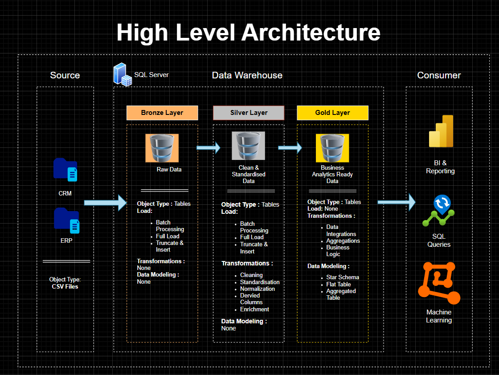
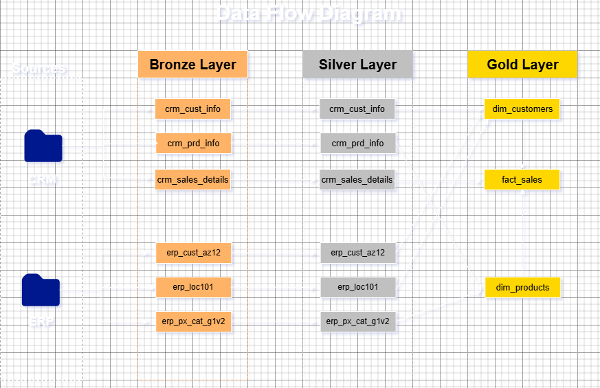
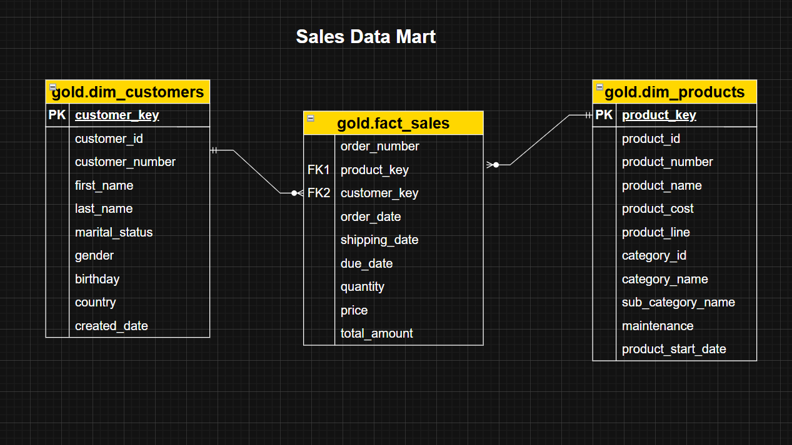

# SQL Data Warehouse (sql-dwh)

A comprehensive SQL Server (T-SQL) based Data Warehouse project designed to ingest, process, and analyze data efficiently. This repository contains the full ETL (Extract, Transform, Load) pipeline, database schema definitions, and raw datasets required to build the warehouse from the ground up.

## 📖 Table of Contents
- [Overview](#-overview)
- [High Level Architecture](#-high-level-architecture)
- [Data Flow](#-data-flow)
- [Data Model](#-data-model)
- [Repository Structure](#-repository-structure)
- [Prerequisites](#-prerequisites)
- [Getting Started](#-getting-started)

## 🔍 Overview
This project implements a **Medallion Architecture** Data Warehouse solution using **T-SQL**. It is designed to transform raw data from multiple sources (CRM and ERP) into actionable insights. The warehouse handles data ingestion, cleansing, normalization, and modeling to support BI reporting and machine learning.

## 🏗 High Level Architecture
The architecture follows a classic Bronze-Silver-Gold layer approach to ensure data quality and lineage.



* **Bronze Layer (Raw Data)**: Acts as the landing zone. Data is ingested from CSV files (CRM and ERP systems) via "Truncate and Load" batch processing. No transformations are applied here; the data is a pure replica of the source.
* **Silver Layer (Clean & Standardized)**: Data is cleansed, normalized, and standardized. Derived columns are added, and data types are validated. This layer serves as the "Source of Truth" for the warehouse.
* **Gold Layer (Business Ready)**: Data is modeled into a Star Schema (Fact and Dimension tables). Aggregations and business logic are applied here to optimize the data for reporting tools (Power BI), SQL queries, and Machine Learning models.

## 🌊 Data Flow
The ETL process creates a unified view by integrating distinct source systems into consolidated dimensions and facts.



The lineage demonstrates how disparate sources are harmonized:
* **CRM Source**: Contributes customer info, product info, and sales details.
* **ERP Source**: Contributes regional customer data (`erp_cust_az12`), location data (`erp_loc101`), and product category data (`erp_px_cat_g1v2`).
* **Integration**: These separate streams flow through Bronze and Silver unchanged in structure, but are finally **merged** in the Gold Layer. For example, customer data from both CRM and ERP combines to populate the single `gold.dim_customers` table.

## 📊 Data Model
The final presentation layer implements a **Star Schema** optimized for analytical queries.



* **Fact Table (`gold.fact_sales`)**: The center of the star, containing transactional metrics like `quantity`, `price`, and `total_amount`, along with foreign keys connecting to dimensions.
* **Dimension Tables**:
    * **`gold.dim_customers`**: Contains descriptive attributes about customers (Name, Gender, Location) linked via `customer_key`.
    * **`gold.dim_products`**: Contains product details including hierarchy (Category, Sub-Category) and costs linked via `product_key`.

## 📂 Repository Structure

```bash
sql-dwh/
├── Diagrams/      # Architecture, Data Flow, and ERD images
├── datasets/      # Raw seed data (CSV) acting as source systems (CRM/ERP)
├── scripts/       # T-SQL scripts for DDL (Tables) and DML (Stored Procs)
│   ├── bronze/    # DDL for Bronze layer tables
│   ├── silver/    # DDL for Silver layer tables
│   └── gold/      # DDL for Gold layer tables and View definitions
└── README.md      # Project documentation
# ⚙️ Prerequisites

Before running the scripts, ensure you have the following installed:

- Microsoft SQL Server (2017 or later)
- SQL Server Management Studio (SSMS) or Azure Data Studio
- Git (for version control)

---

# 🚀 Getting Started

## 1. Clone the Repository

```bash
git clone https://github.com/Rehneet11/sql-dwh.git
cd sql-dwh
```

## 2. Database Setup

Open your SQL client (SSMS) and connect to your SQL Server instance.

### Create the Database

```sql
CREATE DATABASE SQL_DWH;
GO
```

### Execute SQL Scripts

Run the scripts located in the `scripts/` folder.  
It is recommended to run them in the order of the layers:

1. Bronze setup  
2. Silver setup  
3. Gold setup  

---

## 3. Load Data

Import the CSV files from the `datasets/` folder into the Bronze layer tables using your preferred method (Bulk Insert or Import Wizard).

### Example Bulk Insert

```sql
-- Example Bulk Insert
BULK INSERT bronze.crm_cust_info
FROM 'C:\path\to\repo\datasets\cust_info.csv'
WITH (FORMAT = 'CSV', FIRSTROW = 2);
```

---

# 🤝 Contributing

Contributions are welcome! Please create a Pull Request for any enhancements or bug fixes.

**Maintained by Rehneet11**
